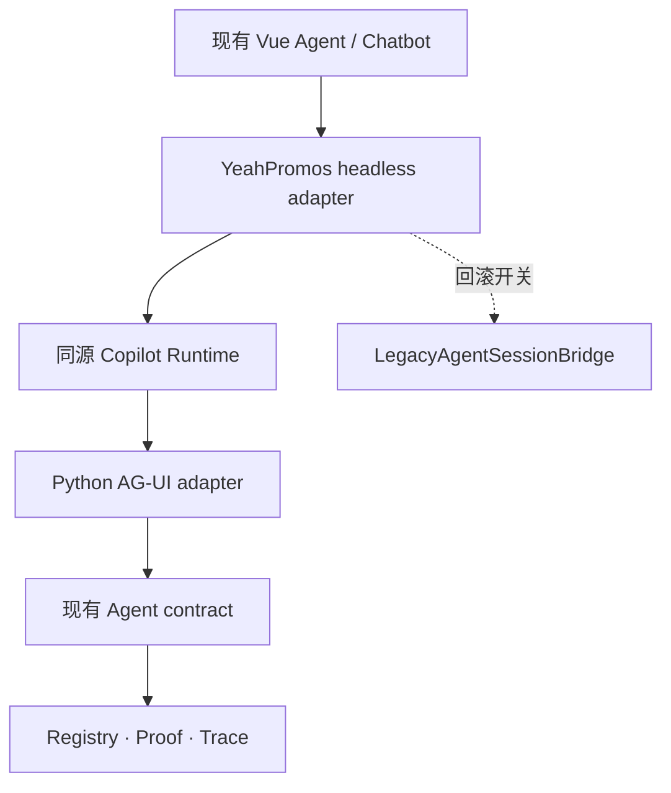

# Offer Intelligence M6 后续：CopilotKit / AG-UI Agent 增量集成方案

> 状态：M06 Vue 迁移已完成；本文已更新为可执行的后续集成计划  
> 目标分支：`FRONTEND-VUE-MIGRATION`  
> 更新基线：`6ccb5ec4d4a28b660a60ed20297f79a070c06ecd`（PR #182 合并后，2026-09-02）  
> 仓库路径：`docs/superpowers/plans/2026-09-02-m6-copilotkit-agent-migration-plan.md`

## 1. 更新结论

M06 的 Agent Vue 迁移已经完成，不再需要按旧计划等待 M6/05：

- Report Mode、Chat Mode、Deep Window、独立 Agent、onboarding/help 已迁移；
- `agent` 已注册到 Modern factory，页面为 Modern-first；
- 规划、工具、合成时间线、流式输出、停止、重试、结构化记忆和隐私边界已在 Vue 中恢复；
- 当前 Vue Agent 通过 `LegacyAgentSessionBridge` 复用 `runChatAgent()`，工具执行仍由 legacy authority 完成；
- M6 行为、mount、cutover、Agent v2/Trace/Python 回归与浏览器验收均已完成；
- 历史测试 `test_chatbot_intent_flow.mjs` 仍会超时，只能作为已知限制，不能计入通过数。

因此，CopilotKit 不再是“完成 M06 Vue 迁移”的条件，而是独立的 **M6-C（CopilotKit integration）增量阶段**。目标是逐步替换会话/传输桥，而不是重写已完成的 Vue 页面或重新实现 Python Agent。

## 2. 当前已验证基线

| 范围 | 2026-09-02 状态 | 本计划处理方式 |
|---|---|---|
| 无 DOM 搜索、分类、路由、分析、压缩 model | 已完成 | 保留，作为 Agent 工具结果的唯一前端业务实现 |
| Report Mode | 已完成 | 保留 `applyPrompt()` / `loadLiveChatbotData()` 受控桥接 |
| Chat Mode | 已完成 | 保留 `/api/chat/stream`、Report Memory、反馈/日志/帮助能力 |
| Deep Window | 已完成 | 保留 controlled operations，不交给通用聊天组件重绘 |
| 独立 Agent Vue 页面 | 已完成 | 保留 `AgentPage.vue`、`AgentTimeline.vue` 和 `agentModel.ts` |
| 会话运行 | Vue 已接管状态；执行经 legacy bridge | M6-C 的主要替换对象 |
| 工具 registry / proof / Trace | Python 权威实现 | 必须复用，禁止在 CopilotKit 中复制第二套权威 |
| CopilotKit 依赖 | 尚未进入前端依赖 | 精确锁版本、独立 bundle、按开关上线 |

事实证据：

- `frontend/src/features/agent/AgentPage.vue`
- `frontend/src/features/agent/AgentTimeline.vue`
- `frontend/src/features/agent/agentModel.ts`
- `frontend/src/entry.ts`
- `docs/chatbot-feature-report.md`
- `docs/superpowers/plans/2026-08-27-frontend-framework-migration-roadmap.md`

## 3. 不变的产品与安全边界

CopilotKit 只能接管通用 Agent 生命周期，不能改变以下契约：

1. `agent_tool_registry.py` 继续是工具 schema、参数上限、结果字段、大小和来源限制的唯一权威；
2. `agent_contract.py` 继续生成和校验 HMAC plan proof；
3. 单轮最多 6 个工具调用、单批最多 4 个、最多一次结构化 replan；
4. 数据结论必须来自受控数据源，模型文本不能代替工具事实；
5. Trace 只保存白名单元数据，不记录 prompt、完整工具 JSON、答案正文或异常堆栈；
6. 用户停止不计为模型错误，未完成轮次不进入正式历史和长期记忆；
7. 浏览器不得直连内部 Agent 服务，也不得持有内部 token；
8. Report、Chat、Deep Window 和独立 Agent 的现有 Vue 交互不得因接入回退。

## 4. 目标架构



- **Vue 页面**继续负责布局、品牌、消息、时间线、记忆、Deep Window 和可访问性；
- **CopilotKit headless 层**只负责 thread、run、message、tool lifecycle、abort 和 AG-UI reducer；
- **Copilot Runtime**负责同源鉴权、内部路由、传输和运行时策略；
- **Python AG-UI adapter**把 AG-UI 事件映射到现有规划/执行/合成协议；
- **现有 Python Agent**继续负责 proof、工具白名单、Trace 和数据可信度；
- **LegacyAgentSessionBridge**在双栈期保留，作为同会话回滚路径。

不采用 BuiltInAgent 重写、默认 UI 整体替换、浏览器直连内部服务、四层同时迁移，也不在 M6-C 验收前删除 legacy bridge。

## 5. 保留、适配与替换清单

| 当前内容 | 动作 | 目标 |
|---|---|---|
| `AgentPage.vue` | 保留 | 继续作为页面和交互入口 |
| `AgentTimeline.vue` | 保留并适配事件 | 消费标准 AG-UI + `oi.*` 扩展事件 |
| `agentModel.ts` | 保留 | 继续负责白名单状态、展示和记忆归一化 |
| `LegacyAgentSessionBridge` | 双栈后替换 | 新增接口兼容的 `CopilotAgentSessionBridge` |
| `runChatAgent()` | 第一阶段复用 | 由 Python adapter 调用现有执行链 |
| `/api/chat/agent`、`/api/chat/stream` | 适配，不立即删除 | 两阶段 continuation 期间继续复用 |
| 自定义 SSE parser | 双栈期保留 | AG-UI 稳定后按路由退出 |
| 工具 registry / proof / Trace | 原样复用 | 禁止复制业务规则 |
| 前端工具执行 | 第一阶段保留 | 后续单独评估迁入服务端 executor |
| CopilotKit 默认 CSS | 不进入生产全局 | 只在视觉对比页作为参考 |

## 6. 协议映射

| 现有语义 | AG-UI / 扩展事件 | Vue 行为 |
|---|---|---|
| 开始运行 | `RUN_STARTED` | 锁定输入，显示停止按钮 |
| 规划 | `STEP_STARTED/FINISHED`，step=`planning` | 时间线显示分析与计划 |
| 工具调用 | `TOOL_CALL_START/ARGS/END` | 展示工具名和安全摘要 |
| 工具结果 | 标准 tool result + `oi.tool.result_meta` | 展示来源、as-of、partial/omitted |
| replan | 新 planning step + `oi.replan` | 时间线新增一次重规划 |
| 流式回答 | `TEXT_MESSAGE_START/CONTENT/END` | 流式 Markdown 与跟随滚动 |
| usage | `oi.usage` | 仅在允许的调试/费用区域显示 |
| 部分结果 | `oi.partial` | 明确标记遗漏项 |
| 完成 | `RUN_FINISHED` | 正式提交历史和安全记忆 |
| 用户停止 | `oi.run.stopped` + abort | 保留临时文本，不提交未完成轮次 |
| 可控失败 | `RUN_ERROR` + 安全错误码 | 提供重试或切回 legacy |

自定义事件统一使用 `oi.*`，payload 必须经过白名单模型。禁止传递 plan proof、完整工具参数/结果、原始 Trace 或 Cookie。

## 7. M6-C 执行阶段

### M6-C/01：冻结当前 Modern Agent 契约

- 固定 `LegacyAgentSessionBridge` 接口；
- 为 idle/running/done/stopped/error、partial/omitted、memory snapshot 建立 fixture；
- 固定 33 个 Agent 场景和现有浏览器验收截图；
- 记录 bundle 体积、首屏、首 token 和停止延迟；
- 将历史超时测试单独标注。

退出条件：新 bridge 可在不改 `AgentPage.vue` 业务布局的前提下替换。

### M6-C/02：依赖与独立 bundle

- 精确锁定同一版本线的 `@copilotkit/vue`、`@copilotkit/runtime` 和必要 AG-UI 包；
- 不使用 `latest` 或宽泛 semver；
- 创建独立 `oi-agent-runtime.js/css`，不把 AI 依赖塞进全站 IIFE 主包；
- 仅在 `dashboard` / `agent` 按需加载，默认 feature flag 关闭。

退出条件：非 Agent 页面 bundle 不增长；CSP、构建、类型和兼容性通过。

### M6-C/03：同源 Runtime 与鉴权

- 新增同源 `/api/copilotkit/*` Runtime；
- 通过现有 `oi_session` Cookie 做会话核验；
- 新增 `OI_COPILOT_INTERNAL_TOKEN`，不复用 `OI_SESSION_SECRET`；
- Runtime 到 Python 使用显式内部 URL，不能从 Host 拼接；
- Cookie、internal token 和 proof 不进入浏览器消息、Trace 或日志；
- 保留两个短运行：规划/工具与合成，共用 `agentRunId` 和 thread。

退出条件：未登录为 401、跨用户 thread 不可读、两阶段均在 serverless 时限内。

### M6-C/04：Python AG-UI adapter

- 解析 `RunAgentInput`，只接收白名单 message/thread/run/state；
- 调用现有规划、proof、工具结果校验、合成和 Trace 模块；
- 发出标准 AG-UI 事件与最小 `oi.*` 元数据；
- 支持 abort、断线、重连去重和重复事件幂等；
- 不修改工具 registry 或 proof 语义。

退出条件：相同 fixture 下 legacy SSE 与 AG-UI 的回答、状态和 Trace 等价。

### M6-C/05：Vue headless bridge 双栈

- 新增 `CopilotAgentSessionBridge`，实现与 legacy bridge 相同的回调接口；
- 由 Provider/composable 管理 run、message、tool、state、abort；
- 继续使用 YeahPromos 组件，不引入默认 CopilotKit 生产视觉；
- 会话级 sticky flag，运行中禁止切栈；
- shadow 模式只比较安全元数据，不重复副作用请求。

退出条件：Agent、Chat、Deep Window、记忆、停止、重试通过同一契约测试。

### M6-C/06：灰度、清理与决策

灰度顺序：本地/CI fixture → 内部账号 1% → 10% → 50% → 100% 稳定至少 7 天 → 再决定是否删除自定义 SSE 和 legacy bridge。

出现 proof 失败、跨用户状态、错误来源、停止后继续写历史、p95 明显恶化或错误率翻倍时，立即按会话切回 legacy。

## 8. 文件级建议

```text
frontend/src/features/agent/
  bridges/
    agentSessionBridge.ts
    legacyAgentSessionBridge.ts
    copilotAgentSessionBridge.ts
  agui/
    eventReducer.ts
    eventAllowlist.ts
    eventFixtures.ts
  copilot/
    CopilotAgentProvider.vue
    useCopilotAgentSession.ts

api/
  copilotkit/index.ts
  chat/agui.py

tests/
  test_agent_agui_adapter.py
  test_copilot_runtime_auth.py
  test_copilotkit_agent_parity.mjs
```

以当前 bridge 实际位置为准，不为目录整洁做无关搬迁。

## 8.1 当前 Vue Agent 增量实现（M6-C/01 的可回滚切片）

本次切片已经落在 `frontend/src`，不改变现有 Python 执行权：

- `features/agent/agentRunReducer.ts` 提供显式 `planning → tools → replan → synthesis → done/stopped/error` 生命周期 reducer；legacy session 的状态快照和未来 AG-UI 事件都可以归一到同一个 reducer；
- `shared/contracts/agentResult.ts` 定义有界的文本/表格/指标结果视图，只允许 `metric`、`table`、`status`、`summary` 四种本地组件；不接受 HTML、完整 tool payload、参数、proof 或 Trace；
- `features/agent/agentResultRegistry.ts` + `results/*` 使用 `markRaw` 的本地组件注册表，`AgentPage.vue` 通过 `<component :is>` 按 `kind` 渲染，不让模型生成组件模板；
- `features/agent/copilotkitTransport.ts` 提供无 UI 依赖的 CopilotKit-compatible SSE transport seam。它只发送 message/history 与 `language/memoryText`，带上 `X-OI-Agent-Authority: python-registry` 路由提示，并将 `timeline`、`token`、`result_view`、`memory`、`done/error` 事件映射到 Vue；该 header 不是认证，Runtime 仍必须在服务端独立执行鉴权和 Python registry/proof；
- `window.OI_COPILOTKIT_RUNTIME` 默认关闭。只有 server-issued `enabled=true` 且 `authority="python-registry"` 时，`entry.ts` 才选择该 transport；否则继续使用 `LegacyAgentSessionBridge`。因此可以按会话切换和回滚，不会把 CopilotKit 默认 Sidebar 或默认 CSS 带入生产 UI。

该切片的定位是“可插拔接入点”，不是在浏览器复制第二套工具 registry。部署 `/api/copilotkit` 前，Runtime 必须完成同源鉴权、thread 绑定、Python registry/proof/Trace 调用和 abort；未满足这些条件时保持 flag 关闭。

本地回归结果：`npm run typecheck` 通过；`npm test -- --run` 为 53 个测试文件 / 240 个用例全通过；`npm run build` 通过。构建仍输出原有 Modern bundle，CopilotKit SDK 未因该切片进入默认依赖。

## 9. 测试与验收矩阵

### 行为

- Report、Chat、Deep Window、独立 Agent 保持 Modern-first；
- 33 个 Agent 场景在两种 bridge 下等价；
- idle/running/done/stopped/error 转换一致；
- planning/tool/synthesis、batch、replan、partial/omitted 一致；
- 新会话、清空、重试、反馈、日志、帮助和 onboarding 无回归；
- stopped run 不写正式历史或结构化记忆。

### 安全与隐私

- 未登录、过期/伪造 Cookie、伪造 internal token 被拒绝；
- proof 过期/不匹配、未知工具、超限调用被拒绝；
- 浏览器无 internal token、proof 和完整 Trace；
- Trace 无 prompt、完整工具 JSON、答案正文、Cookie 或异常堆栈；
- 用户 A 不能读取用户 B 的 thread、run 或 memory。

### 流式、构建与体验

- token 顺序、UTF-8 分片、断线、重连、重复事件和 `RUN_ERROR` 有测试；
- abort 能终止 provider 或忽略后续事件；
- `npm test`、typecheck、Vite build、Python 回归全通过；
- 非 Agent 首屏不加载 CopilotKit bundle；
- 视觉回归覆盖 1280、1440、移动宽度；
- 键盘可完成新会话、发送、停止、展开时间线和重试；
- focus ring、44px 触控目标、对比度、`aria-live`、reduced motion 通过。

## 10. 三套视觉方向

| 方向 | 用途 | 决策 |
|---|---|---|
| 当前 YeahPromos | 蓝色、紧凑、数据工作台感 | 保留为 parity 基线 |
| CopilotKit 默认皮肤 | 评估官方默认层级与状态表达 | 仅对比，不直接上线 |
| 无障碍混合方案 | YeahPromos 品牌 + CopilotKit 状态表达 + 高对比/大目标 | 推荐方向 |

推荐混合方案使用 YeahPromos 深蓝导航、品牌蓝/红提示，保留数据密度，同时采用更清晰的运行状态、可展开时间线、44px 控件、可见 focus、文本化状态和 reduced-motion。

## 11. 完成定义

- CopilotKit/AG-UI 不改变业务、安全、数据和隐私契约；
- Vue 页面与视觉组件继续为唯一产品 UI；
- Runtime 鉴权和内部调用通过越权测试；
- legacy 与 AG-UI 在行为、状态、Trace 和来源上等价；
- 100% 灰度稳定至少 7 天且可一键回滚；
- 删除 legacy 前有独立审批和回归证据；
- 路线图、功能报告、运行手册和本计划同步更新。

## 12. 参考

- [M0–M8 前端迁移路线图](https://github.com/Yeahpromos/offer-intelligence/blob/FRONTEND-VUE-MIGRATION/docs/superpowers/plans/2026-08-27-frontend-framework-migration-roadmap.md)
- [Chatbot / Agent 功能报告](https://github.com/Yeahpromos/offer-intelligence/blob/FRONTEND-VUE-MIGRATION/docs/chatbot-feature-report.md)
- [Offer Intelligence 当前分支](https://github.com/Yeahpromos/offer-intelligence/tree/FRONTEND-VUE-MIGRATION)
- [YeahPromos 线上产品](https://www.yeahpromo.asia/)
- [CopilotKit 仓库](https://github.com/CopilotKit/CopilotKit)
- [CopilotKit Vue 文档](https://docs.copilotkit.ai/vue)
- [AG-UI 协议](https://github.com/ag-ui-protocol/ag-ui)

---

本次更新以 PR #182 合并后的 Modern-first Agent 为事实基线。后续若分支继续变化，执行 M6-C/01 前必须重新核对 `entry.ts`、Agent bridge、工具 registry、proof/Trace 和测试统计。
