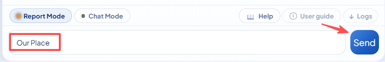
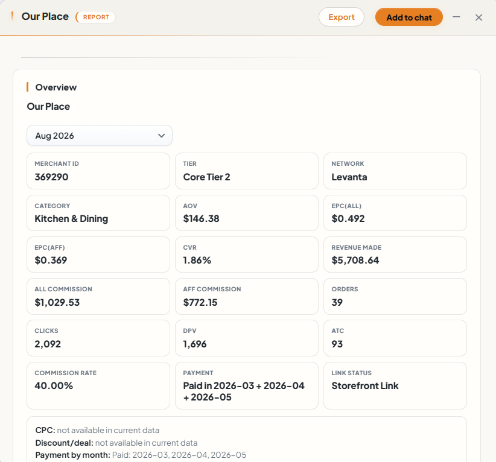
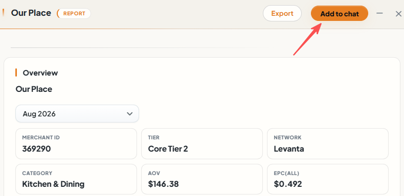
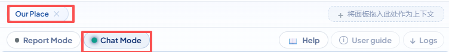
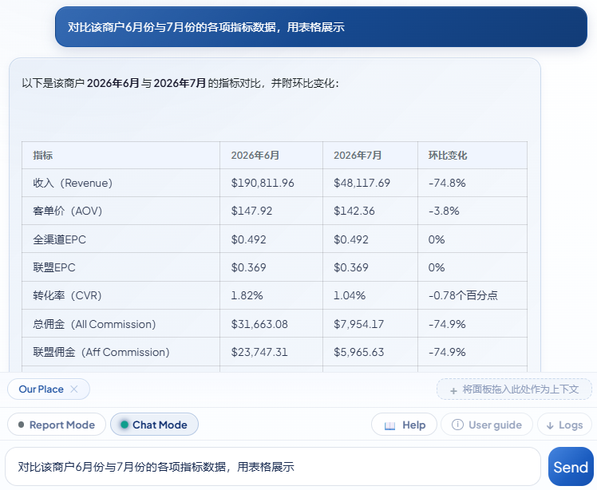

## Before you start: Understand the two modes

- **Report Mode**: Use it to enter a merchant name, merchant ID, ASIN, or category and generate an analysis report.
- **Chat Mode**: Use it to ask follow-up questions, clarify details, and get analysis suggestions based on the report context.

## Step 1: Open Chatbot and ask a question in Report Mode

1. Click the Chatbot assistant icon.
2. Confirm that the current mode is **Report Mode**.
3. Enter a merchant name, merchant ID, ASIN, or category, such as `Shokz`.
4. Click **Send** to start generating the report.

### Example image

## Step 2: Wait for the Deep Window report

1. Wait for Chatbot to finish the analysis.
2. When the report is ready, it appears in the floating **Deep Window**.
3. If the assistant panel covers the report, drag it to a suitable position.
4. Review the report data, conclusions, and available actions.

### Example image

## Step 3: Click “Add to chat” in the report

1. Confirm that the report has finished generating in the Deep Window.
2. Click **Add to chat**.
3. The current report is added to Chatbot context for the next conversation.

### Example image

## Step 4: Confirm the memory bar and enter Chat Mode

1. After clicking **Add to chat**, the page switches to **Chat Mode**.
2. Confirm that the current report card appears in the Chatbot memory bar.
3. If you need more room for the input area, minimize the Deep Window and then check the memory card.
4. The report in the memory bar is the context used for follow-up questions.

### Example image

## Step 5: Ask a follow-up question in Chat Mode

1. Confirm that the current mode is **Chat Mode** and the report remains in the memory bar.
2. Ask a follow-up question, such as “Based on the report, give me some analysis suggestions.”
3. Click **Send**. Chatbot will answer using the report context.
4. Continue asking questions without submitting the report again.

### Example image

## Common actions after completing the tour

- To generate a new analysis report, switch to **Report Mode** and ask a new question.
- To continue discussing the current report, stay in **Chat Mode** and send your question.